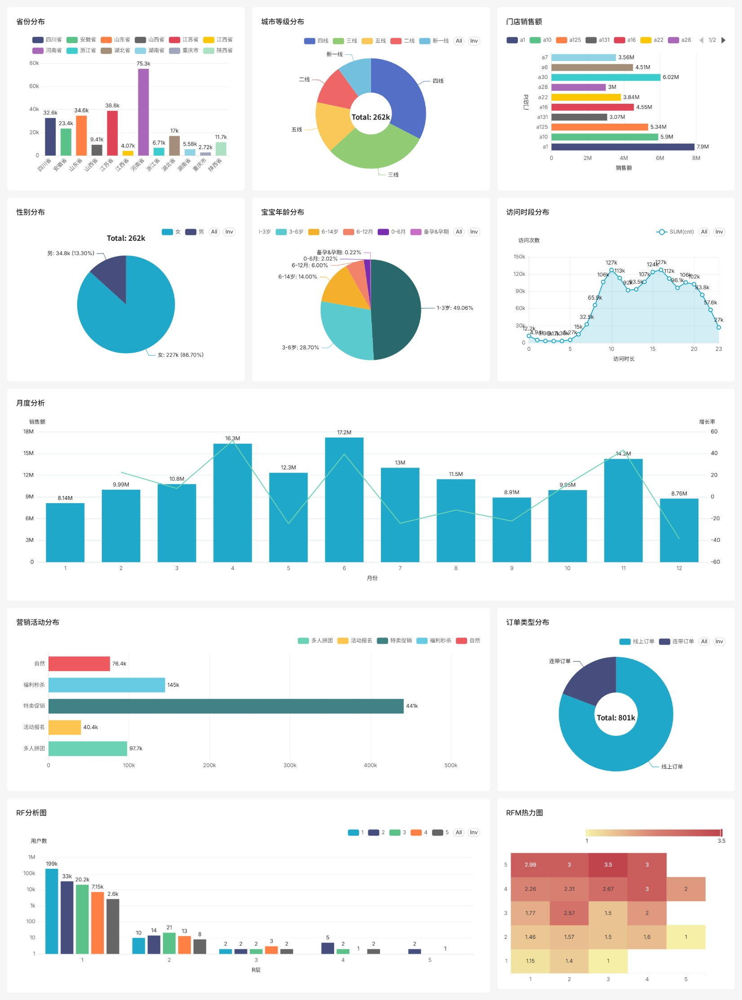

# 母婴零售用户行为分析

基于 82 万订单、26 万会员、162 万访问记录，完成从数据清洗、数据库建模，到 BI 可视化与 RFM 用户分层的全流程。

## 看板预览



完整看板包含 11 张图：省份分布、城市等级、门店销售、性别、宝宝年龄段、访问时段、月度分析、营销活动、订单类型、RF 分析、RFM 热力图。

## 数据来源

本数据集来自和鲸社区（heywhale.com），搜索"母婴零售数据集清洗版本"。

- **原始数据**：3 个 CSV（会员、订单、流量）
- **数据量**：82 万订单、26 万会员、162 万访问
- **数据时间**：2021 年

**下载方式：**
1. 打开 heywhale.com
2. 搜索"母婴零售数据集清洗版本"
3. 下载 3 个 CSV
4. 放到 `data/raw/` 目录

## 技术栈

| 层 | 工具 | 说明 |
|----|------|------|
| 数据清洗 | Python + pandas | 用于数据预处理、缺失值处理、格式标准化 |
| 数据库 | PostgreSQL + Docker | 容器化部署，提供稳定、并发支持的数据存储 |
| BI 可视化 | Apache Superset | 开源BI工具，支持丰富图表类型和交互式看板 |

## 核心发现

1. **用户画像**：86.7% 女性，1-3 岁宝宝家长为主
2. **地域**：下沉市场为主，河南占 28.7%
3. **访问高峰**：10 点、15 点、20 点
4. **销售波动**：大促后必跌
5. **RFM**：76% 用户流失（R=1）

## 项目结构
```
muying-retail-analysis/
├── data/
│ ├── raw/ # 原始 CSV（需自行下载）
│ └── processed/ # 清洗后
├── etl/
│ └── clean.py
├── db/
│ ├── schema.sql
│ └── load_to_pg.py
├── analysis/
│ └── rfm.py
├── docs/
│ ├── analysis_report.md
│ └── data_dictionary.md
├── docker-compose.yml
├── superset_config.py
├── .env
└── README.md
```


## 环境要求与快速开始

### 1. Python 环境

建议使用 Anaconda 创建独立环境：

```bash
conda create -n muying python=3.11 -y
conda activate muying
pip install pandas openpyxl psycopg2-binary sqlalchemy
```

### 2. Docker Desktop

1.  下载并安装 Docker Desktop：https://www.docker.com/products/docker-desktop/
2.  安装时请勾选 **Use WSL 2**（Windows 用户）
3.  安装完成后重启电脑
4.  打开 Docker Desktop，等待状态变为稳定运行（通常为绿色）

**验证安装：**

```bash
docker --version
docker run hello-world
```
看到 "Hello from Docker!" 信息即表示安装成功。

### 3. 下载数据

从和鲸社区下载 3 个 CSV 文件，放到项目的 `data/raw/` 目录下：

- `members.csv`
- `orders.csv`
- `traffic.csv`

### 4. 清洗数据

在项目根目录执行：

```bash
python etl/clean.py
```

此步骤会处理原始数据中的缺失值、重复记录、格式不一致等问题，输出到 `data/processed/` 目录。

### 5. 启动数据库和 Superset

在项目根目录执行：

```bash
docker compose up -d
```

这会启动配置好的 PostgreSQL 数据库和 Apache Superset 服务。

### 6. 初始化 Superset

执行以下命令初始化 Superset，创建管理员账户并升级数据库：

```bash

# 创建管理员用户
docker exec -it superset superset fab create-admin --username admin --firstname Admin --lastname User --email admin@example.com --password admin

# 升级数据库结构
docker exec -it superset superset db upgrade

# 初始化角色和权限
docker exec -it superset superset init
```

### 7. 建表并导入数据

将数据库表结构导入 PostgreSQL 并加载清洗后的数据：

```bash

# 导入数据库 Schema（Windows PowerShell）
Get-Content db\schema.sql | docker exec -i postgres-muying psql -U postgres -d muying

# 执行 Python 脚本将数据导入数据库
python db/load_to_pg.py
```

> **注意**：如果使用的是 Linux/macOS 或 Git Bash，请将 `Get-Content` 替换为 `cat`：
> 
```bash

cat db/schema.sql | docker exec -i postgres-muying psql -U postgres -d muying

```
### 8. 执行 RFM 分析

```bash
python analysis/rfm.py
```

### 9. 访问 Superset 看板

1.  在浏览器中打开：`http://localhost:8088`
2.  使用管理员账号登录：
    - **用户名**：`admin`
    - **密码**：`admin`
3.  登录后，导航至 **Dashboards**，打开名为 `母婴零售用户分析` 的看板。

**已创建的图表清单：**

- 订单类型分布
- 营销活动分布
- 访问时段分布
- 省份分布
- 城市等级分布
- 宝宝年龄段分布
- 性别分布
- 月度GMV与增长率
- 门店销售 Top 10
- RF 用户分层
- RFM 热力图

## 数据字典

详细的字段说明、数据类型和业务含义请见 `docs/data_dictionary.md`。

## 分析报告

完整的分析过程、方法论、核心发现和业务建议请见 `docs/analysis_report.md`。

## License

MIT