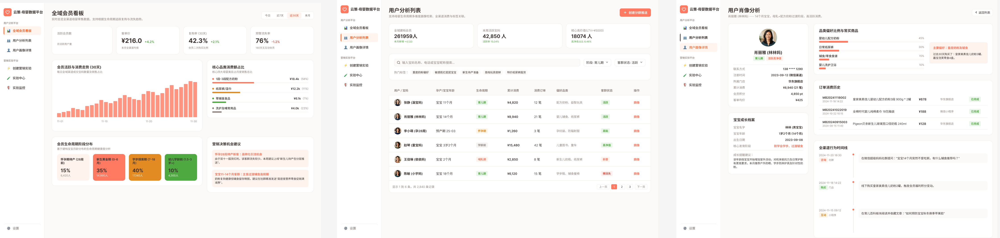
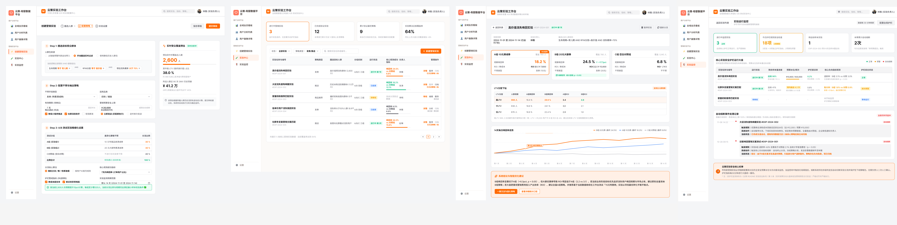

# 母婴零售全域用户数据平台

一个覆盖「用户画像 → 流失预警 → 策略实验 → 结论沉淀」完整闭环的母婴零售数据产品设计与实现。
从数据建模、流失预测模型，到产品设计原型与实验平台，端到端独立完成。

## 项目背景

母婴零售行业用户生命周期极短（0-3 岁），用户随宝宝成长快速流失：

- 奶粉段位切换、辅食过渡、断奶等关键节点均是流失高发期
- 传统运营依赖经验「广撒网」发券，成本高、唤回率低、无法归因

本项目旨在回答三个业务问题：

1. **谁在流失？** —— 建立流失预警模型，提前识别高危用户
2. **如何唤回？** —— 通过科学 AB 实验验证干预策略的因果效果
3. **如何沉淀？** —— 将实验结论产品化，形成可复用的策略资产

## 产品架构：五步闭环

监控 → 发现 → 理解 → 行动 → 复盘

| 模块 | 核心能力 | 使用角色 |
|---|---|---|
| ① 全域会员看板 | 监控 KPI、生命周期分布、自动输出营销机会建议 | 运营主管 |
| ② 用户分析列表 | 流失预警排序、多维标签检索 | 私域运营 |
| ③ 用户画像详情 | RFM/LTV 标签、全渠道行为时间线 | 运营/导购 |
| ④ 创建营销实验 | 圈人-策略-分流-指标四层配置 | 运营 |
| ⑤ 实验中心 | 实验管理、自动归因、结论沉淀 | 运营/主管 |

---

## 产品原型（共 7 页）

### 第一部分：用户分析平台

| 页面 | 说明 |
|---|---|
| **全域会员看板** | 活跃会员 26.2 万、复购率 42.3%、预警流失率 76%；生命周期四阶段分布；系统自动输出「营销决策机会建议」 |
| **用户分析列表** | 支持生命周期/客群状态/热门标签多维检索，按「流失概率 × 用户价值」加权排序 |
| **用户画像详情** | 单用户 360° 视图：品类偏好、订单历史、**咨询-购买-互动全渠道行为时间线** |

### 第二部分：营销实验平台

| 页面 | 说明 |
|---|---|
| **创建营销实验** | 三步向导：圈人（实时人群预估）→ 策略（可配置干预类型）→ 实验设置（分流 + 最小样本量校验） |
| **实验中心列表** | 实验全景管理，核心指标内联展示，覆盖发券/推送/推荐三类策略 |
| **实验详情页** | 三组对比卡片、45 天趋势图、**系统自动归因结论与策略优化建议** |
| **实验运行监控** |护栏指标实时看板：预算水位、客诉阈值、负向指标预警，命中红线自动熔断分流并沉淀熔断记录|

---

## 核心设计思想

### 1. 把「统计学规范」产品化

跑 AB 实验的操作很简单，难的是**保证结论可信**。本平台通过产品设计强制落实五条实验纪律：

- ✅ **随机分流**（哈希取模），消灭选择偏差
- ✅ **强制对照组**（50%），所有提升与自然基线对比
- ✅ **指标口径前置定义**（如「30 天内产生订单的用户占比」）
- ✅ **最小样本量校验**（统计功效检验，创建时自动提示）
- ✅ **护栏指标监控**（券成本超支、客诉率异常自动熔断）

> 让不懂统计的运营，按三步走出来的实验结论都可信。

### 2. 数据不停留在看板上，而是形成飞轮

实验产出结论 → 结论沉淀为人群包/策略 → 驱动下一轮实验

详情页的「系统归因结论」支持一键保存至策略库，
例如：*「20 元券对 LTV>¥5000 用户 ROI 达 4.8，建议分人群用券」* ——
结论即资产，可被后续实验一键复用。

### 3. 从「单点流失工具」到「通用实验基础设施」

策略框架抽象为四个可配置插槽：

**[圈人 Who] → [动作 What] → [分流 How] → [指标 Judge]**

同一套流程可支撑：流失唤回、新客首单转化、品类交叉渗透、文案测试、推送时机优化…… **产品沉淀的是方法论，而非某个具体功能。**

---

## 未来规划：AI 时代的实验平台

一个常见疑问：*「AI 足够智能后，这个系统还有必要吗？」*

我的答案是：**AI 越强，实验平台越重要——角色从工具升级为基础设施。**

- AI 擅长从历史数据中发现**相关性**，并提出海量策略假设
- 但「相关性 ≠ 因果性」——策略是否真有效，只能通过**随机对照实验**验证
- 未来图景：

AI（大脑） 实验平台（法庭）
提出假设与策略 ────────→ 验证策略因果效果
“建议给高LTV流失 ←──────── 随机对照实验给出裁决：
用户发20元券” 真提升 or 相关性假象
↑ │
└──── 实验结论回流，AI 学习迭代 ────┘

- **创建实验环节**将逐步由 AI Agent 自动化，人只需审批
- **平台核心价值升级**：从「运营跑实验的工具」进化为「**AI 策略的因果验证场**」
- 企业竞争的本质将变为：`AI 提假设的速度 × 实验验证的吞吐量`

---

## 技术实现

| 层 | 技术栈 |
|---|---|
| 数据层 | PostgreSQL / MySQL · RFM 与 LTV 标签建模 · 用户生命周期分层 |
| 算法层 | Python（随机森林）流失预警模型 · AUC 0.77 |
| 产品层 | Figma 原型设计 · AB 实验体系设计 |

---

## 项目文档

- [完整分析报告](analysis_report.md) —— 数据方法与核心发现
- [PRD v1.0](PRD.md) —— 营销策略平台需求文档（圈人 → 配策略 → 执行 → 回收）
- [数据字典](data_dictionary.md) —— 字段说明与数据口径

## License

MIT